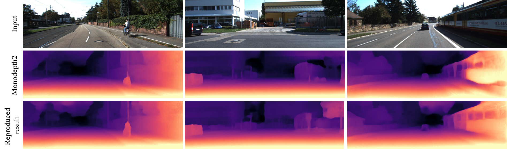

# Self-supervised Monocular Trained Depth Estimation using Self-attention and Discrete Disparity Volume - ML Reproducibility Challenge 2020

This project is a reproduction of the CVPR 2020 paper
> **Self-supervised Monocular Trained Depth Estimation 
>   using Self-attention and Discrete Disparity Volume**
>
> Adrian Johnston, Gustavo Carneiro  
>
> [CVPR 2020 (arXiv pdf)](https://arxiv.org/pdf/2003.13951.pdf)

It proposes to close the performance gap with the fully-supervised
methods using only the monocular sequence for training with the help
of additional layers - self-attention and discrete disparity volume.

 

Setup procedure
----------------
1. Clone project from [GitHub](https://github.com/sjsu-smart-lab/Self-supervised-Monocular-Trained-Depth-Estimation-using-Self-attention-and-Discrete-Disparity-Volum).  
      Change to the directory Self-supervised-Monocular-Trained-Depth-Estimation-using-Self-attention-and-Discrete-Disparity-Volum.
2. Install packages  
   In order to reproduce the code install the packages by running the below
   command.

           pip install -r requirements.txt
           
    This project uses Python 3.6.6, cuda 10.1, pytorch 0.4.1, torchvision 0.2.1, tensorboardX 1.4 and opencv.
    The experiments were conducted using NVIDIA Tesla P100 GPU and CPU environment - Intel Xeon E5-2660 v4 (2.0GHz, 35M Cache). 

3. Download the required data sets.  
      The data set that is used in this project are [KITTI Raw](http://www.cvlibs.net/datasets/kitti/raw_data.php)
      and leftImg8bit of [Cityscapes](https://www.cityscapes-dataset.com/).

Training
--------- 
The paper claims to achieve state-of-the-art results using only monocular sequence,
unlike previous algorithms which relied on both stereo and monocular 
images.

    python3 train.py --data_path <path to kitti dataset> --log_dir tmp/ --model_name <model> --png
    
For setting/ altering other input parameters for abalation study or
hyperparameter search refer the [options.py](options.py)

Evaluation
-----------
Prepare ground truth data by

    python export_gt_depth.py --data_path kitti_data --split eigen --dataset <kitti or cityscapes>

The accuracy and loss values of a trained model can be infered using the
below command

    python evaluate_depth.py --data_path <path to kitti dataset> --load_weights_folder <trained model weights> --eval_mono --png

Inference
---------
The inference prints the depth map, space occupied by the model and inference time
as output for a given image(s) file/folder.

    python test_simple.py --image_path <image(s) path> --model_name <model weights>
    

Results
--------

Below are the results obtained on the KITTI Raw test set for the models trained in the project.

> NOTE    
   The results obtained are system specific. Due to different combinations of the neural 
   network cudnn library versions and NVIDIA driver library versions, the results can be 
   slightly different. To the best of my knowledge, upon reproducing the environment, the
   ballpark number will be close to the results obtained.

| abs_rel | sq_rel | RMSE  | RMSE log | a1    | a2    | a3    |
|:-------:|:------:|:-----:|:--------:|:-----:|:-----:|:-----:|
| 0.108   | 93.13  | 4.682 | 0.185    | 0.889 | 0.962 | 0.982 |

| Training time | Inference time (CPU) | Inference time (GPU) | Memory   |
|:-------------:|:--------------------:|:--------------------:|:--------:|
| 204 hours     | 6108.5 +/- 12.23     | 653.21 +/- 0.98      | 252.7 MB |

References
-----------
1. Monodepth2 - https://github.com/nianticlabs/monodepth2       
2. OCNet - https://github.com/openseg-group/OCNet.pytorch
3. DORN - https://arxiv.org/abs/1806.02446
